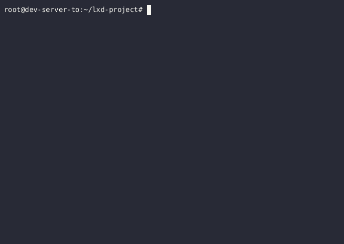

# lxd-project

An application that launches lxc containers when an incoming ssh request is detected.

## Demo



## Installation

```bash
snap install lxd && python3 -m pip install -r requirements.txt
```

then

```bash
lxc init
```

and follow the prompts.

## Usage

```bash
python3 main.py
```

and then `ssh {username}@localhost -p 3022` with a username of your choice and an arbitrary password.